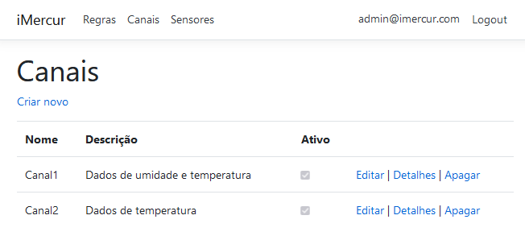
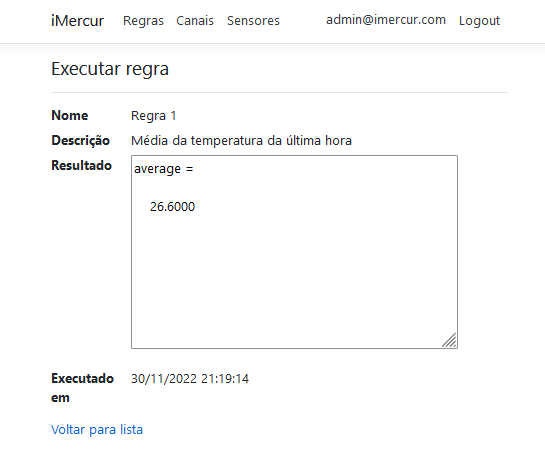

# Framework iMercur

## 1. Introdução

O Framework iMercur foi concebido para promover a integração entre plataformas que registram dados contextuais e plataformas de computação científica para o processamento de contextos complexos, possibilitando a extração de informações a partir de um processamento científico explorando computação numérica, permitindo, inclusive, que esse processamento possa ser realizado por infraestruturas de computação distribuídas, com as plataformas a serem integradas estando alojadas em diferentes equipamentos. 

## 2. Telas 

### 2.1. Login

### 2.2. Canais

Tela de cadastro de canais.

Tela de listagem de canais cadastrados.

### 2.3. Regras

Tela de criação de regras.

Tela de listagem de regras criadas.

## 2.4. Execução

Tela da execução de uma regra com o resultado de vizualização gráfica.

Tela de execução de uma regra com o resultado textual.

